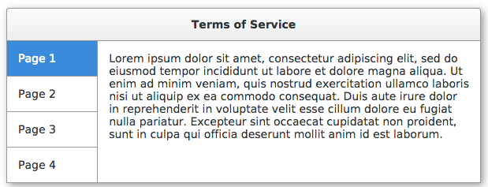
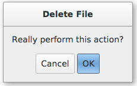
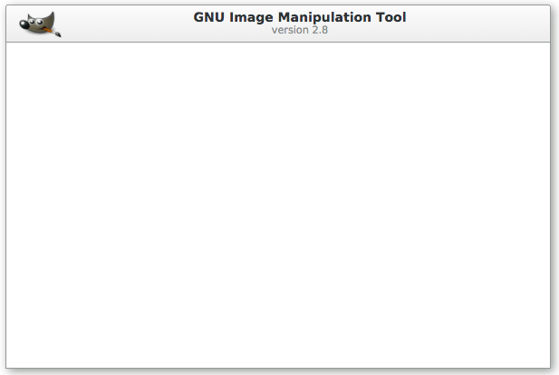

# gtk.css

A CSS framework based on GTK+. The goal is to allow developers
to maintain a familiar UI appearance, even when using tools
like Electron, or just a browser app in general.

This is not a "replacement" of GTK+, but a completement thereof.

## Features
* Semantic class names
* Customizable SASS
* Bower and NPM-based builds
* MIT License
* Examples of every component

# Screenshots

# Contribution
This project is just in its early stages; if it
is to last in the long term, it will take a group effort.
Open to issues and PRs!